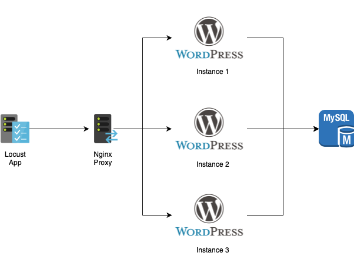
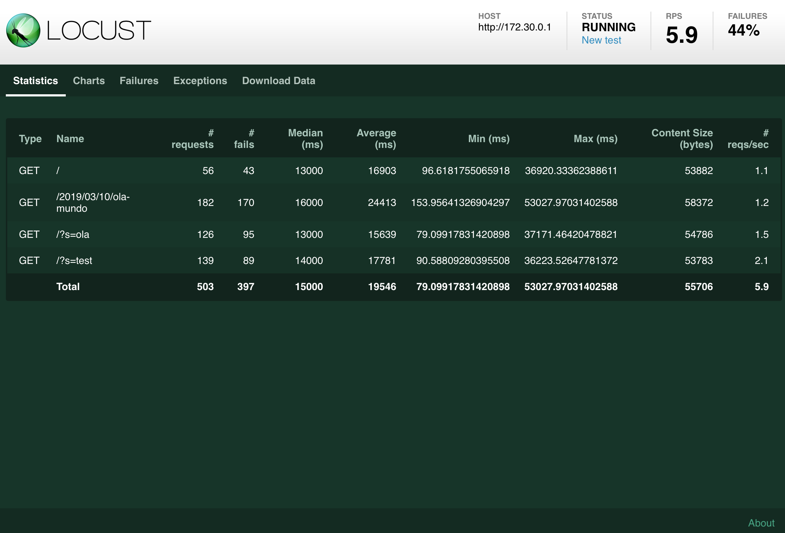

# docker-locust
Docker Locust Performance Test with Wordpress

* Locust `https://locust.io` is an open source loading test tool where users behavior can be simulated with python code.

## Scheme

*  Only nginx is on accessible network to the users and locust app.
*  Wordpress and MySQL can only be accessible from nginx.



## How to use

### Configure containers

* Create containers (proxy, wordpress and mysql).
* Clone this repository and execute this commands:

```
$ cd docker
$ docker-compose up -d
$ docker ps --format "table {{.Image}}\t{{.Status}}\t{{.Names}}\t{{.Ports}}"
```

* Verify if the 5 containers is up

```
IMAGE               COMMAND                  NAMES                 PORTS
nginx:latest        "nginx -g 'daemon of…"   docker_nginx_1        0.0.0.0:80->80/tcp, 0.0.0.0:443->443/tcp
wordpress:latest    "docker-entrypoint.s…"   docker_wordpress2_1   80/tcp
wordpress:latest    "docker-entrypoint.s…"   docker_wordpress1_1   80/tcp
wordpress:latest    "docker-entrypoint.s…"   docker_wordpress3_1   80/tcp
mysql:5.5.60        "docker-entrypoint.s…"   docker_db_1           3306/tcp
```

* Open `http://localhost`
* Install e configure WordPress 
* Open `nginx.log` to get IP that was generated -- in this case is `172.19.0.1`

```
$ tail nginx/log/access.log

172.19.0.1 - - [16/Mar/2019:00:33:48 +0000] "GET / HTTP/1.1" 200 5477 "http://localhost/wp-admin/edit.php?post_type=page" "Mozilla/5.0 (Macintosh; Intel Mac OS X 10_14_3) AppleWebKit/605.1.15 (KHTML, like Gecko) Version/12.0.3 Safari/605.1.15"
172.19.0.1 - - [16/Mar/2019:00:33:50 +0000] "GET /wp-includes/js/comment-reply.min.js?ver=5.1.1 HTTP/1.1" 200 1093 "http://localhost/2019/03/15/ola-mundo/" "Mozilla/5.0 (Macintosh; Intel Mac OS X 10_14_3) AppleWebKit/605.1.15 (KHTML, like Gecko) Version/12.0.3 Safari/605.1.15"
172.19.0.1 - - [16/Mar/2019:00:33:50 +0000] "GET /2019/03/15/ola-mundo/ HTTP/1.1" 200 6783 "http://localhost/" "Mozilla/5.0 (Macintosh; Intel Mac OS X 10_14_3) AppleWebKit/605.1.15 (KHTML, like Gecko) Version/12.0.3 Safari/605.1.15"

```

### Configure locust

* Open `locustfile.py` on folder `/docker/locusts/scripts/` and change IP address with one that was generated on line `host = os.getenv('TARGET_URL', "http://172.19.0.1")`.
* For this project I created 3 task to be tested -- Feel free to change with your own tasks.

```python
import os                                                                                  
import string                                                                              
import random                                                                              
from locust import HttpLocust, TaskSet, task                                                     
                                                                                           
class SimpleTrafficRequest(TaskSet):       

    @task(1)
    def index(self):
        self.client.get("/")
    
    @task(2)
    def search_for_blog_post(self):
        self.client.get("/?s=ola")
    
    @task(2)
    def search_for_blog_unpost(self):
        self.client.get("/?s=test")

class WebsiteUser(HttpLocust):         
    host = os.getenv('TARGET_URL', "http://172.19.0.1")
    task_set = SimpleTrafficRequest                            
    min_wait = 5000
```
* Create image and container for locust.
* Run docker image and add to existing network.
* Call locust command with parameters of the file and of host 

```
$ cd locusts
$ docker build -t locust:latest .
$ docker run --rm -ti -p 8089:8089 --network=docker_default locust:latest /bin/sh
/ # locust -f locustfile.py --host=http://172.19.0.1
```

* Go to url `http://localhost:8089` 
* Enter the parameters on the fields `Number of users to simulate` and `Hatch rate (users spawned/second)` on form and press the button `Start swarming`
* The locust will start to executing the tasks and collecting data from request and response.


